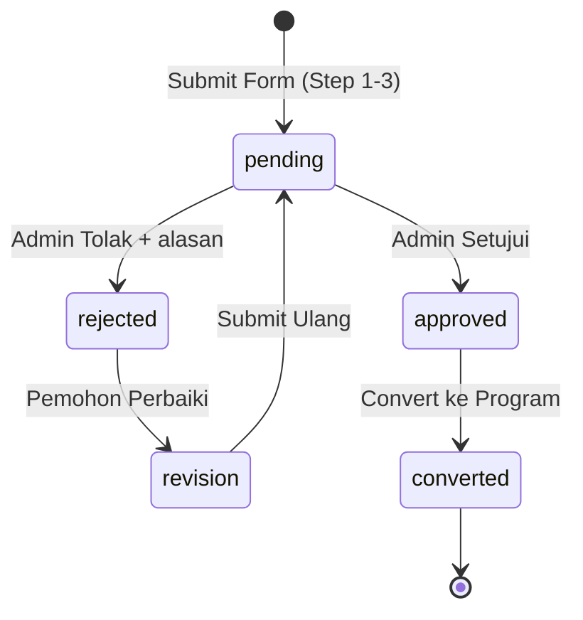

# 📋 Proposal Step Form — Implementation Plan (v2 Normalized)

> **Tanggal**: 3 Mei 2026 | **Status**: Draft

---

## 1. Analisis Redundansi Schema Saat Ini

### 1.1 Masalah: Data Duplikasi di 3 Tempat

```
SEBELUM (REDUNDANT):

┌─ proposal_biofloc ──────┐  ┌─ biofloc_thematic ─────────┐  ┌─ available_locations ─┐
│ name ←──────────────────────→ name                       │  │ name                 │
│ province_id ←───────────────────────────────────────────────→ province_id          │
│ regency_id  ←───────────────────────────────────────────────→ regency_id           │
│ district, village        │  │ address (concat district+  │  │                      │
│                          │  │          village)           │  │                      │
│ (plan: kusuka_number) ←────→ kusuka_number               │  │                      │
│ (plan: nib) ←──────────────→ nib                         │  │                      │
│ (plan: legal_entity) ←─────→ legal_entity_number         │  │                      │
│ (plan: member_count) ←─────→ total_members               │  │                      │
│ (plan: board_member) ←─────→ total_management            │  │                      │
└──────────────────────────┘  └────────────────────────────┘  └──────────────────────┘

→ Kalau di-update di satu tempat, tempat lain STALE.
→ Semakin banyak field, semakin banyak duplikasi.
```

### 1.2 Solusi: Normalisasi dengan `kdmp_entities`

Ekstrak semua **data identitas KDMP** ke tabel bersama yang direferensi oleh proposal DAN program.

```
SESUDAH (NORMALIZED):

┌─ kdmp_entities (NEW) ────────────────────────────────────────────┐
│ id, name, name_search                                            │
│ kusuka_number, kusuka_verified, nib, legal_entity_number         │
│ chairman_name, chairman_phone                                    │
│ companion_name, companion_phone                                  │
│ board_member_count, member_count                                 │
└──────────────────────────────────────────────────────────────────┘
          ▲                                    ▲
          │ entity_id FK                       │ entity_id FK
          │                                    │
┌─ proposal_biofloc (LEAN) ──┐  ┌─ biofloc_thematic (LEAN) ───────┐
│ id, entity_id FK           │  │ id, entity_id FK                 │
│ location_id FK             │  │ location_id FK, proposal_id FK   │
│ status (pending/approved/  │  │ status (potential/active)        │
│   rejected/revision/       │  │ fiscal_year                      │
│   converted)               │  │                                  │
│ PROPOSAL-SPECIFIC:         │  │ PROGRAM-SPECIFIC:                │
│ - land_slope               │  │ - progress_percent               │
│ - has_land_prep_letter     │  │ - commodity_aid ←(proposed_comm.) │
│ - proposed_commodity ──────────→ commodity_potential ←(potentials)│
│ - has_experienced_member   │  │ - land_area, production_value    │
│ - commodity_potentials[] ──────→ (joined as text)                │
│ - proposal_path            │  │ - distribution_amount            │
│ - fiscal_year              │  │ - sppg_partner, address          │
│                            │  │ - s_curve_path                   │
│ REVIEW:                    │  │                                  │
│ - reviewed_by, reviewed_at │  │                                  │
│ - rejection_reason         │  │                                  │
│ - admin_notes              │  │                                  │
└────────────────────────────┘  └──────────────────────────────────┘
```

**Keuntungan**:
- **Single source of truth** untuk identitas KDMP
- Update `kusuka_number` di satu tempat → semua terkait ikut terupdate
- Proposal dan program bisa punya field yang **benar-benar berbeda**
- Scalable: kalau ada program tematik lain (minapadi), tinggal FK ke `kdmp_entities`

---

## 2. Schema Database Final

### 2.1 Tabel Baru: `kdmp_entities`

```sql
CREATE TABLE IF NOT EXISTS kdmp_entities (
  -- biarkan id auto increment agar join tetap efisien (BIGSERIAL)
  id BIGINT GENERATED BY DEFAULT AS IDENTITY PRIMARY KEY, 

  -- Identitas Kelompok
  name TEXT NOT NULL,
  name_search TEXT GENERATED ALWAYS AS (lower(name)) STORED,

  -- Legalitas (diverifikasi via API external)
  kusuka_number TEXT,
  kusuka_verified BOOLEAN DEFAULT FALSE,
  nib TEXT,
  legal_entity_number TEXT,

  -- Pengurus
  chairman_name TEXT,
  chairman_phone TEXT,
  companion_name TEXT,
  companion_phone TEXT,
  board_member_count INTEGER DEFAULT 0,
  member_count INTEGER DEFAULT 0,

  created_at TIMESTAMPTZ DEFAULT NOW(),
  updated_at TIMESTAMPTZ DEFAULT NOW()
);

CREATE INDEX idx_kdmp_name_search ON kdmp_entities (name_search);
CREATE INDEX idx_kdmp_kusuka ON kdmp_entities (kusuka_number);
GRANT ALL ON TABLE kdmp_entities TO anon, authenticated, service_role;
```

### 2.2 Tabel Revised: `proposal_biofloc_thematic_programs`

> **KEPUTUSAN**: Wilayah (province, regency, district, village) **TIDAK disimpan di proposal**.
> Proposal cukup punya `location_id` FK → `available_locations` yang sudah menyimpan seluruh hierarki wilayah.
> Ini menghilangkan duplikasi wilayah antara proposal dan available_locations.

```sql
CREATE TABLE IF NOT EXISTS proposal_biofloc_thematic_programs (
  id UUID PRIMARY KEY, -- uuidv7 implemenation
  entity_id BIGINT NOT NULL REFERENCES kdmp_entities(id),
  location_id BIGINT NOT NULL REFERENCES available_locations(id),

  -- Status & Review
  status VARCHAR(20) NOT NULL DEFAULT 'pending'
    CHECK (status IN ('pending','approved','rejected','revision','converted')),
  user_id UUID REFERENCES auth.users(id),
  reviewed_by UUID REFERENCES users(id),
  reviewed_at TIMESTAMPTZ,
  rejection_reason TEXT,
  admin_notes TEXT,

  -- Proposal-specific data (TIDAK ada di biofloc_thematic)
  land_slope DECIMAL(5,2),
  has_land_preparation_letter BOOLEAN DEFAULT FALSE,
  proposed_commodity TEXT,
  has_experienced_member BOOLEAN DEFAULT FALSE,
  commodity_potentials TEXT[],
  other_commodity_potential TEXT,
  proposal_path TEXT NOT NULL,
  fiscal_year INTEGER DEFAULT 2025,

  created_at TIMESTAMPTZ DEFAULT NOW(),
  updated_at TIMESTAMPTZ DEFAULT NOW()
);
```

### 2.3 Tabel Revised: `biofloc_thematic_programs`

```sql
-- SETELAH MIGRASI (drop name, kusuka_number, nib, legal_entity_number → pakai entity_id)
CREATE TABLE IF NOT EXISTS biofloc_thematic_programs (
  id UUID PRIMARY KEY, -- uuidv7 implemenation
  entity_id BIGINT NOT NULL REFERENCES kdmp_entities(id),
  location_id BIGINT REFERENCES available_locations(id),
  proposal_id UUID REFERENCES proposal_biofloc_thematic_programs(id),

  -- Status & Tahun
  status VARCHAR(20) NOT NULL CHECK (status IN ('potential','active','inactive')),
  fiscal_year INTEGER NOT NULL DEFAULT 2026,

  -- Program Operational (TIDAK ada di proposal)
  progress_percent INTEGER CHECK (progress_percent BETWEEN 0 AND 100) DEFAULT 0,
  commodity_aid TEXT NOT NULL,
  commodity_potential TEXT,
  land_area TEXT NOT NULL,
  total_management INTEGER NOT NULL DEFAULT 0,  -- akan dihapus (pakai entity)
  total_members INTEGER NOT NULL DEFAULT 0,     -- akan dihapus (pakai entity)
  distribution_amount INTEGER NOT NULL DEFAULT 0,
  production_value TEXT NOT NULL,
  sppg_partner TEXT NOT NULL,
  address TEXT NOT NULL,
  s_curve_path TEXT,

  created_at TIMESTAMPTZ DEFAULT NOW(),
  updated_at TIMESTAMPTZ DEFAULT NOW()
);
```

> **NOTE**: `total_management` dan `total_members` di `biofloc_thematic_programs` **tetap dipertahankan sementara** untuk backward compat dengan seeder 2025. Long-term, ini bisa dihapus dan selalu dibaca dari `kdmp_entities.board_member_count` / `member_count`. Atau bisa jadi computed view.

### 2.4 Tabel `available_locations` — Diperkaya dengan Wilayah Lengkap

> **KEPUTUSAN**: `available_locations` menjadi **satu-satunya tempat** menyimpan data wilayah.
> Baik proposal maupun biofloc mengakses wilayah via `location_id` FK.
> `name` tetap dipertahankan sebagai cached display name dari `kdmp_entities`.

```sql
CREATE TABLE IF NOT EXISTS available_locations (
  id BIGINT GENERATED BY DEFAULT AS IDENTITY PRIMARY KEY,

  -- Wilayah FK ke reference tables (kode Kemendagri, dot-separated)
  province_code TEXT NOT NULL REFERENCES ref_provinces(code),   -- '32'
  regency_code TEXT NOT NULL REFERENCES ref_regencies(code),    -- '32.01'
  district_code TEXT REFERENCES ref_districts(code),            -- '32.01.01'
  village_code TEXT REFERENCES ref_villages(code),              -- '32.01.01.2001'

  type VARCHAR(50) NOT NULL,  -- biofloc_thematic, isf, minapadi_thematic
  name TEXT NOT NULL,         -- cached display name

  latitude DECIMAL(10, 8) NOT NULL,
  longitude DECIMAL(11, 8) NOT NULL,

  created_at TIMESTAMPTZ DEFAULT NOW(),
  updated_at TIMESTAMPTZ DEFAULT NOW()
);
```

> **NOTE migrasi**: Kolom existing `province_id` dan `regency_id` perlu di-rename/migrasi ke format dot-separated.
> Contoh: `province_id='32'` → `province_code='32'` (sama), `regency_id='3201'` → `regency_code='32.01'` (tambah dot).

### 2.5 Tabel Reference Wilayah (Self-Hosted)

> **KEPUTUSAN**: Wilayah disimpan di database sendiri (bukan API external).
> Data di-seed sekali dari dataset Kemendagri. Menggunakan format kode **dot-separated**.

```sql
-- === PROVINSI ===
CREATE TABLE IF NOT EXISTS ref_provinces (
  code TEXT PRIMARY KEY,       -- '11', '32', '33'
  name TEXT NOT NULL            -- 'Aceh', 'Jawa Barat'
);

-- === KABUPATEN/KOTA ===
CREATE TABLE IF NOT EXISTS ref_regencies (
  code TEXT PRIMARY KEY,                              -- '11.01', '32.01'
  province_code TEXT NOT NULL REFERENCES ref_provinces(code),
  name TEXT NOT NULL                                   -- 'Kabupaten Aceh Selatan'
);

-- === KECAMATAN ===
CREATE TABLE IF NOT EXISTS ref_districts (
  code TEXT PRIMARY KEY,                              -- '11.01.01', '32.01.01'
  regency_code TEXT NOT NULL REFERENCES ref_regencies(code),
  name TEXT NOT NULL                                   -- 'Bakongan'
);

-- === DESA/KELURAHAN ===
CREATE TABLE IF NOT EXISTS ref_villages (
  code TEXT PRIMARY KEY,                              -- '11.01.01.2001'
  district_code TEXT NOT NULL REFERENCES ref_districts(code),
  name TEXT NOT NULL                                   -- 'Keude Bakongan'
);

-- Indexes untuk cascading lookup
CREATE INDEX idx_ref_regencies_province ON ref_regencies (province_code);
CREATE INDEX idx_ref_districts_regency ON ref_districts (regency_code);
CREATE INDEX idx_ref_villages_district ON ref_villages (district_code);

GRANT SELECT ON TABLE ref_provinces, ref_regencies, ref_districts, ref_villages
  TO anon, authenticated, service_role;
```

### 2.6 Standarisasi Kode Wilayah (Dot-Separated Kemendagri)

| Level | Format | Contoh | Tabel Reference |
|-------|--------|--------|----------------|
| Provinsi | 2 digit | `11` (Aceh), `32` (Jawa Barat) | `ref_provinces` |
| Kabupaten | parent.XX | `11.01` (Kab. Aceh Selatan) | `ref_regencies` |
| Kecamatan | parent.XX | `11.01.01` (Bakongan) | `ref_districts` |
| Desa | parent.XXXX | `11.01.01.2001` (Keude Bakongan) | `ref_villages` |

**Cascading query pattern**:
```sql
-- Dapatkan semua kabupaten di Aceh
SELECT * FROM ref_regencies WHERE province_code = '11';
-- Dapatkan semua kecamatan di Kab. Aceh Selatan
SELECT * FROM ref_districts WHERE regency_code = '11.01';
-- Dapatkan semua desa di Kec. Bakongan
SELECT * FROM ref_villages WHERE district_code = '11.01.01';
```

---

## 3. Migrasi Data Existing (Seeder 2025)

Seeder 2025 sudah memasukkan ~100 record ke `biofloc_thematic_programs` TANPA proposal. Untuk migrasi:

```sql
-- 1. Buat kdmp_entities dari data existing biofloc
INSERT INTO kdmp_entities (name, kusuka_number, nib, legal_entity_number,
  board_member_count, member_count)
SELECT name, kusuka_number, nib, legal_entity_number,
  total_management, total_members
FROM biofloc_thematic_programs
WHERE proposal_id IS NULL;

-- 2. Update biofloc_thematic_programs → set entity_id
UPDATE biofloc_thematic_programs btp
SET entity_id = ke.id
FROM kdmp_entities ke
WHERE ke.kusuka_number = btp.kusuka_number
  AND btp.proposal_id IS NULL;

-- 3. (Long-term) DROP redundant columns dari biofloc_thematic_programs
-- ALTER TABLE biofloc_thematic_programs DROP COLUMN name;
-- ALTER TABLE biofloc_thematic_programs DROP COLUMN kusuka_number;
-- dst. (hati-hati, perlu update semua query)
```

> **IMPORTANT**: Jangan langsung drop kolom. Lakukan secara bertahap:
> 1. Phase 1: Tambah `entity_id`, isi dari data existing
> 2. Phase 2: Semua query baca dari `kdmp_entities` via JOIN
> 3. Phase 3: Drop kolom duplikat setelah semua code ter-update

---

## 4. Alur Proposal Lifecycle



### Flow Detail

| # | Aksi | Database Operation |
|---|------|--------------------|
| 1 | User submit form | INSERT `kdmp_entities` → INSERT `available_locations` → INSERT `proposal` (status: pending) |
| 2 | Admin approve | UPDATE `proposal.status = 'approved'`, set `reviewed_by/at` |
| 3 | Admin reject | UPDATE `proposal.status = 'rejected'`, set `rejection_reason` |
| 4 | User revisi | UPDATE `kdmp_entities` fields + UPDATE `proposal` fields, status → pending |
| 5 | Admin convert | INSERT `biofloc_thematic_programs` (entity_id = proposal.entity_id, status: potential), UPDATE `proposal.status = 'converted'` |

---

## 5. Integrasi API External

### 5.1 KUSUKA Verification

```typescript
// features/proposal/services/kusuka-verification.ts
export async function verifyKusukaNumber(kusukaNumber: string): Promise<{
  valid: boolean;
  data?: { name: string; nib: string; legal_entity_number: string };
}> {
  const res = await fetch(`${KUSUKA_API_URL}/verify?number=${kusukaNumber}`,
    { headers: { Authorization: `Bearer ${KUSUKA_API_KEY}` } });
  return res.json();
}
```

**Strategi**: Non-blocking. Simpan `kusuka_verified: false` saat submit, verifikasi async atau saat admin review. Wajib verified sebelum convert ke program.

### 5.2 Wilayah (Self-Hosted, Cascading Dropdown)

**Sumber data**: Database lokal (`ref_provinces`, `ref_regencies`, `ref_districts`, `ref_villages`).
**Bukan** external API — lebih reliable dan cepat.

```typescript
// lib/services/wilayah-service.ts (server-side, query Supabase langsung)
export async function getProvinces() {
  return supabase.from('ref_provinces').select('code, name').order('name');
}
export async function getRegencies(provinceCode: string) {
  return supabase.from('ref_regencies').select('code, name')
    .eq('province_code', provinceCode).order('name');
}
export async function getDistricts(regencyCode: string) {
  return supabase.from('ref_districts').select('code, name')
    .eq('regency_code', regencyCode).order('name');
}
export async function getVillages(districtCode: string) {
  return supabase.from('ref_villages').select('code, name')
    .eq('district_code', districtCode).order('name');
}
```

**UI**: Cascading `<Select>` di `LocationKdmpForm`. Simpan **kode** ke `available_locations`, nama di-resolve via JOIN saat display.

---

## 6. Perubahan Code

### 6.1 Server Action: `proposal-actions.ts`

```typescript
export async function createProposal(formData: FormData) {
  // 1. Validasi (existing Zod, semua 3 step)
  // 2. INSERT kdmp_entities → dapatkan entity_id
  // 3. INSERT available_locations → dapatkan location_id
  // 4. INSERT proposal_biofloc_thematic_programs (entity_id, location_id, status:'pending')
  // 5. Return success
}
```

### 6.2 Convert Service Update

```typescript
// Sebelumnya: copy name, address dari proposal ke biofloc
// Sesudah: cukup copy entity_id, tidak perlu duplikasi field
export async function convertProposalToThematicProgramService(proposalId, value) {
  const proposal = await getProposal(proposalId); // includes entity_id
  await supabase.from(TABLES.BIOFLOC_THEMATIC_PROGRAMS).insert({
    entity_id: proposal.entity_id,      // ← SHARED reference
    location_id: proposal.location_id,
    proposal_id: proposalId,
    status: 'potential',
    // Hanya program-specific fields:
    commodity_aid: value.commodity_aid,
    land_area: value.land_area,
    // ... dst
  });
}
```

### 6.3 Query Changes — JOIN Pattern

```typescript
// Sebelumnya: SELECT name, kusuka_number FROM biofloc_thematic_programs
// Sesudah:
const { data } = await supabase
  .from(TABLES.BIOFLOC_THEMATIC_PROGRAMS)
  .select(`
    id, status, progress_percent, commodity_aid, ...,
    kdmp_entities!inner (name, kusuka_number, nib, ...),
    available_locations (latitude, longitude)
  `);
```

### 6.4 Schema & Form Updates

| File | Perubahan |
|------|-----------|
| `location-kdmp-schema.ts` | Tambah `district_name`, `village_name`, ubah `_id` fields ke kode Kemendagri |
| `LocationKdmpForm.tsx` | Cascading Select dropdowns (RegencySelect, DistrictSelect, VillageSelect) |
| `proposal-store.ts` | Tambah field name untuk wilayah |
| `thematic/types/thematic.ts` | Tambah `'revision'` ke ProposalBioflocStatus |

### 6.5 File Baru

| File | Fungsi |
|------|--------|
| `supabase/migrations/YYYYMMDD_create_ref_wilayah.sql` | 4 tabel reference wilayah |
| `supabase/migrations/YYYYMMDD_create_kdmp_entities.sql` | Tabel entitas KDMP |
| `supabase/migrations/YYYYMMDD_alter_available_locations.sql` | Tambah district_code, village_code |
| `supabase/migrations/YYYYMMDD_alter_tables_add_entity_id.sql` | FK entity_id ke proposal & biofloc |
| `supabase/migrations/YYYYMMDD_migrate_existing_to_entities.sql` | Data migration seeder |
| `supabase/seeders/XX_ref_wilayah_seeders.sql` | Seed data provinsi s/d desa |
| `lib/services/wilayah-service.ts` | Query wilayah dari DB |
| `components/shared/RegencySelect.tsx` | Dropdown kabupaten |
| `components/shared/DistrictSelect.tsx` | Dropdown kecamatan |
| `components/shared/VillageSelect.tsx` | Dropdown desa |
| `features/proposal/services/kusuka-verification.ts` | Verifikasi KUSUKA (future-ready) |
| `features/thematic/actions/proposal-review.ts` | Admin review actions |
| `lib/constants/tables.ts` | Tambah `KDMP_ENTITIES`, `REF_PROVINCES`, dll |

---

## 7. Prioritas Implementasi

### Phase 1: Wilayah Reference Tables
- [ ] Buat 4 tabel `ref_provinces`, `ref_regencies`, `ref_districts`, `ref_villages`
- [ ] Seed data wilayah dari dataset Kemendagri
- [ ] Migrasi `available_locations`: rename province_id→province_code, tambah district_code & village_code

### Phase 2: Schema Foundation
- [ ] Buat tabel `kdmp_entities`
- [ ] Tambah `entity_id` ke proposal & biofloc tables
- [ ] Migrasi data existing seeder → `kdmp_entities`
- [ ] Update `TABLES` constant

### Phase 3: Proposal Insert + Wilayah UI
- [ ] Buat `lib/services/wilayah-service.ts` (query dari DB)
- [ ] Buat cascading Select components (Regency, District, Village)
- [ ] Update `LocationKdmpForm.tsx` — cascading dropdown
- [ ] Update `proposal-actions.ts` — INSERT ke DB
- [ ] Update Zod schemas & `proposal-store.ts`

### Phase 4: Admin Review (Adjust Existing)

> **NOTE**: Action `updateProposalBioflocStatus` di `features/thematic/actions/proposal-biofloc.ts` **sudah ada**.
> Cukup sesuaikan untuk mendukung schema baru (entity_id, rejection_reason, reviewed_by, dll).

- [ ] Update `updateProposalStatusService` — tambah parameter `rejection_reason`, `admin_notes`, `reviewed_by`
- [ ] Update `ProposalBioflocProgramPage` — sesuaikan view dengan schema baru (JOIN kdmp_entities)
- [ ] Update `ProposalBioflocDetailPage` — sesuaikan detail view dengan field baru dari entity
- [ ] Tambah dialog rejection dengan textarea wajib untuk `rejection_reason`

### Phase 5: Revisi Proposal (Reuse Step Form)

> **KEPUTUSAN**: Proposal yang ditolak bisa diedit menggunakan **step form yang sama**.
> Saat user membuka proposal rejected, form di-pre-populate dari data existing.
> Setelah edit & submit ulang → status kembali ke `pending`.

- [ ] Buat route `/biofloc-thematic/proposal/[id]/edit` yang reuse `ProposalThematicPage`
- [ ] Pre-populate step form dari data proposal + kdmp_entity yang sudah ada
- [ ] Pada submit: UPDATE `kdmp_entities` + UPDATE `proposal` fields, set status → `pending`
- [ ] Tampilkan `rejection_reason` sebagai banner info di atas form saat mode edit

> **Commodity Mapping saat Convert**:
> - `proposed_commodity` (proposal) → pre-fill `commodity_aid` (biofloc)
> - `commodity_potentials[]` (proposal) → pre-fill `commodity_potential` (biofloc, joined as text)
> - Admin tetap bisa adjust kedua field ini di form convert yang sudah ada

### Phase 6: KUSUKA (Future-Ready)
- [ ] Buat service stub `kusuka-verification.ts` dengan interface yang jelas
- [ ] `kdmp_entities.kusuka_verified` sudah tersedia — tinggal plug API nanti
- [ ] Badge verifikasi KUSUKA di admin review (show verified/unverified)

### Phase 7: Cleanup (Long-term)
- [ ] Migrate semua query ke JOIN pattern via `kdmp_entities`
- [ ] Drop kolom duplikat dari `biofloc_thematic_programs` (`name`, `kusuka_number`, `nib`, `legal_entity_number`)
- [ ] Drop `total_management` & `total_members` dari `biofloc_thematic_programs` (selalu baca dari `kdmp_entities`)
- [ ] Update seeder untuk menggunakan `kdmp_entities`

---

## 8. Resolved Questions & Decisions

| # | Pertanyaan | Keputusan |
|---|------------|----------|
| 1 | **API KUSUKA** | Belum ada endpoint/API key. Schema sudah ready (`kdmp_entities.kusuka_verified`). Akan di-plug saat dev API siap, tanpa rombak. |
| 2 | **API Wilayah** | ✅ Self-hosted di 4 tabel reference (`ref_provinces`, `ref_regencies`, `ref_districts`, `ref_villages`). |
| 3 | **File Upload** | ✅ Wajib saat submit. Sudah diaktifkan di Step 3 (`proposal_path` + `documentations`). |
| 4 | **Revisi Proposal** | Proposal ditolak → user edit via step form yang sama (reuse). Setelah submit ulang → status kembali `pending`. |
| 5 | **`total_management` & `total_members`** | Long-term: hapus dari `biofloc_thematic_programs`, selalu sinkronkan & baca dari `kdmp_entities`. |
| 6 | **Format kode wilayah** | Dot-separated (`'32.01'`, `'32.01.01'`, `'32.01.01.2001'`). Seeder existing perlu migrasi. |

## 9. Resolved Questions (Batch 2)

| # | Pertanyaan | Keputusan |
|---|------------|----------|
| 1 | **Dataset wilayah** | Dari CSV. Perlu download dataset Kemendagri terbaru, convert ke SQL seed. |
| 2 | **Notifikasi** | Tidak perlu untuk saat ini. |
| 3 | **Audit trail** | Belum perlu. Cukup `reviewed_by` + `reviewed_at` saja. |
| 4 | **Quota check** | Belum perlu. Bisa ditambahkan nanti tanpa rombak. |
| 5 | **Concurrent edit** | Selalu check status terkini sebelum approve/reject di server side. Jika status sudah berubah, reject action + tampilkan error. UI tombol disembunyikan untuk status yang tidak relevan. |
| 6 | **Migrasi seeder** | Seeder & dataset wilayah pakai dot-format (`'32.01'`). Dilakukan sekaligus di Phase 1. |
